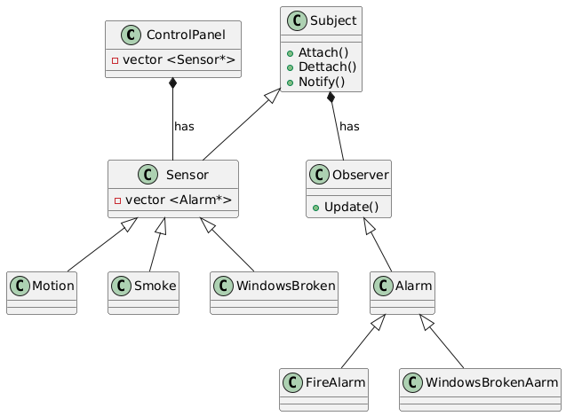

## Alarm System Project
This is a project of Standart Events System that includes Control Panel, sensors and devices wich communicate via RF simulation.
## Multithreading:
  The ControlPanel::monitor method Start in a separate thread to continuously check if any sensor is triggered.
  Each Sensor or Device has it own thread to simulate the triggering of sensors.
## Synchronization:
  The std::mutex mtx is used in the MessageQueue class to ensure thread safety when accessing the data.
## Class Diagram

