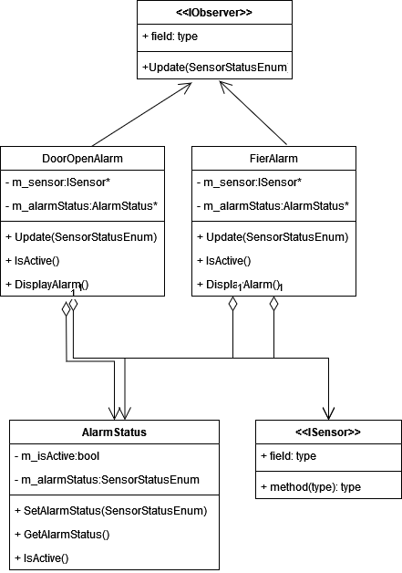

## Alarm System Project
This repository contains a project of Standart Events System designed for home security. It integrates various devices, sensors, events, and a control panel to create an intelligent system capable of responding to real-time changes in the environment wich communicate via RF simulation. The communication between devices, sensors and contro pannel designed using RF (Radio Frequency) simulation.
## Multithreading:
  The ControlPanel::monitor method Start in a separate thread to continuously check if any sensor is triggered.
  Each Sensor or Device has it own thread to simulate the triggering of sensors.
## Synchronization:
  The std::mutex mtx is used in the MessageQueue class to ensure thread safety when accessing the data.
## Class Diagram

